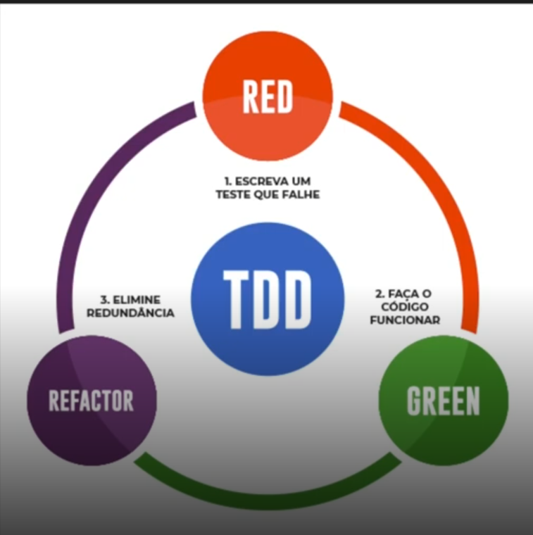

# 🚀 Entendendo o Desafio

## 📑 Índice

1. [Descrição do Desafio](#descrição-do-desafio)
2. [Objetivos de Aprendizagem](#objetivos-de-aprendizagem)
3. [O que são Testes de Software](#o-que-são-testes-de-software)
4. [O que são Agentes de IA](#o-que-são-agentes-de-ia)
5. [Ferramentas Utilizadas](#ferramentas-utilizadas)
6. [O que é LangChain](#o-que-é-langchain)
7. [Exemplo Prático](#exemplo-prático-geração-automatizada-de-testes-unitários)
8. [Documentação do Processo](#documentação-do-processo)
9. [Funcionamento do Código](#funcionamento-do-código)
10. [Execução na Nuvem](#execução-na-nuvem-azure-openai)
11. [Detalhes do Resultado](#detalhes-do-resultado-da-execução)
12. [Como criar e configurar o deployment no Azure](#como-criar-e-configurar-o-deployment-do-modelo-chatgpt-no-azure-openai)
13. [Considerações Finais](#considerações-finais)

---

## 1. 📋 Descrição do Desafio

Neste projeto, o objetivo é automatizar a criação de testes unitários utilizando modelos de linguagem, integrando LangChain com Azure ChatGPT. O desafio consiste em aplicar conceitos de agentes de IA para gerar, validar e documentar testes unitários de funções Python, promovendo boas práticas de desenvolvimento e documentação técnica.

---

## 2. 🎯 Objetivos de Aprendizagem

- Aplicar conceitos de agentes de IA e automação de testes em um ambiente prático.
- Documentar processos técnicos de forma clara e estruturada.
- Utilizar o GitHub para compartilhar documentação e código de forma colaborativa.

---

## 3. 🧪 O que são Testes de Software

**Conceito:**  
Testes de software são procedimentos que verificam se o sistema atua conforme o esperado. Eles fazem parte do ciclo de qualidade, garantindo confiabilidade e robustez no código.

**Tipos de testes:**  
- Testes manuais: realizados passo a passo por humanos  
- Testes automatizados: executados automaticamente, garantindo repetibilidade  
- Testes de unidade: validam funções/métodos isolados  
- Testes de integração: verificam a interação entre componentes  
- Testes ponta a ponta (E2E): simulam o uso completo do sistema

**Testes automatizados e TDD:**  
Testes automatizados aceleram o feedback e reduzem erros humanos.  
TDD (Test Driven Development):  
1️⃣ Red: escrever um teste que falha  
2️⃣ Green: fazer o teste passar  
3️⃣ Refactor: melhorar o código sem alterar o comportamento  


---

## 4. 🤖 O que são Agentes de IA

Agentes são sistemas que percebem o ambiente e tomam ações para atingir objetivos. Em IA, eles utilizam técnicas de aprendizado de máquina para:  
- Reagir a instruções (Zero-shot)  
- Planejar operações em múltiplas etapas  

No prompting de zero-shot, o modelo é solicitado a gerar uma resposta sem receber um exemplo da saída desejada para o caso de uso.

---

## 5. 🛠️ Ferramentas Utilizadas

- **LangChain:** Biblioteca Python que permite criar agentes inteligentes, integrando LLMs (Large Language Models) com lógica de aplicação, prompts customizados, chains e ferramentas externas.
- **Azure ChatGPT:** Serviço de IA da Azure que fornece acesso a modelos avançados de linguagem, permitindo geração de texto, análise e automação de tarefas.
- **PythonREPLTool:** Ferramenta do LangChain que executa código Python dinamicamente, útil para validar resultados gerados pelo agente.
- **GitHub:** Plataforma para versionamento, colaboração e compartilhamento de documentação técnica.

---

## 6. 🔗 O que é LangChain

LangChain é uma biblioteca Python para criar sistemas que integram LLMs com lógica de aplicação:  
- LLMs: acesso a modelos como GPT  
- Prompts: templates para estruturar chamadas  
- Chains: sequências de prompts e processos  
- Agents: executam ações usando ferramentas

---

## 7. 💡 Exemplo Prático: Geração Automatizada de Testes Unitários

A seguir, um exemplo de agente que recebe uma função Python e utiliza o Azure ChatGPT para gerar testes unitários automaticamente, validando-os com o PythonREPLTool.

```python
from langchain.prompts import PromptTemplate
from langchain import LLMChain
from langchain.llms import AzureChatOpenAI
from langchain.agents import initialize_agent, Tool, AgentType
from langchain.tools.python.tool import PythonREPLTool

# Função alvo para geração de testes
function_code = """
def soma_lista(lista):
    return sum(lista)
"""

# Prompt para gerar testes unitários
prompt = PromptTemplate(
    input_variables=["code"],
    template="""Você é um especialista em Python. Gere testes unitários usando pytest para a função abaixo:

{code}

Retorne apenas o código dos testes.
"""
)

# Configuração do LLM usando Azure ChatGPT
llm = AzureChatOpenAI(deployment_name="SeuDeployment", temperature=0)

# Chain para geração dos testes
chain = LLMChain(llm=llm, prompt=prompt)
generated_tests = chain.run(function_code)

# Ferramenta para executar e validar os testes
tools = [
    Tool(
        name="PythonExecutor",
        func=PythonREPLTool().run,
        description="Executa código Python para validar testes unitários"
    )
]

# Inicialização do agente
agent = initialize_agent(
    tools,
    llm,
    agent=AgentType.ZERO_SHOT_REACT_DESCRIPTION
)

# Execução: validação dos testes gerados
result = agent.run(f"{function_code}\n{generated_tests}\nExecute os testes e informe o resultado.")

print("Testes Gerados:\n", generated_tests)
print("Resultado da Execução:\n", result)
```

---

## 8. 📝 Documentação do Processo

1. O agente recebe o código da função alvo.
2. Utiliza o Azure ChatGPT para gerar testes unitários com base nas melhores práticas.
3. Valida os testes automaticamente usando PythonREPLTool.
4. Documenta os resultados e compartilha via GitHub.

---

## 9. ⚙️ Funcionamento do Código

O arquivo `main.py` utiliza LangChain e Azure ChatGPT para automatizar a geração e validação de testes unitários para uma função Python que calcula a integral definida de um polinômio usando numpy. O fluxo é:

1️⃣ O código da função alvo é enviado para o modelo Azure ChatGPT via LangChain.  
2️⃣ O modelo gera testes unitários em pytest, cobrindo casos típicos e limites matemáticos.  
3️⃣ Os testes gerados são executados automaticamente usando PythonREPLTool.  
4️⃣ O resultado dos testes é exibido no terminal.

---

## 10. ☁️ Execução na Nuvem (Azure OpenAI)

Para rodar o projeto com Azure OpenAI, siga os passos:

1. Crie um recurso Azure OpenAI no portal Azure.
2. Implemente um deployment do modelo ChatGPT (ex: gpt-35-turbo) e anote o nome do deployment.
3. Configure as variáveis de ambiente no seu sistema ou em um arquivo `.env`:
   ```
   AZURE_OPENAI_API_KEY=<sua-chave>
   AZURE_OPENAI_ENDPOINT=https://<seu-endpoint>.openai.azure.com/
   AZURE_OPENAI_API_VERSION=2023-05-15
   ```
4. Instale as dependências do projeto:
   ```
   pip install langchain openai azure-identity azure-ai-openai numpy pytest
   ```
5. Edite o parâmetro `deployment_name` em `main.py` para corresponder ao nome do seu deployment no Azure.
6. Execute o arquivo principal:
   ```
   python main.py
   ```
7. O resultado exibirá os testes gerados e o resultado da execução/validação dos testes unitários para a função fornecida.

---

## 11. 📊 Detalhes do Resultado da Execução

Após rodar o comando acima, o agente irá:

- **Exibir o código dos testes unitários gerados automaticamente:**  
  O modelo Azure ChatGPT cria testes em pytest para a função fornecida, cobrindo diferentes cenários e limites matemáticos.

- **Executar os testes gerados:**  
  Utilizando o PythonREPLTool, o agente executa os testes no ambiente Python.

- **Mostrar o resultado da validação dos testes:**  
  O terminal apresentará se os testes passaram ou falharam, incluindo mensagens de erro ou sucesso para cada caso testado.

Exemplo de saída esperada:
```
Testes Gerados:
import pytest
import numpy as np

from your_module import integral_polinomial

def test_integral_linear():
    # Integral de f(x) = 2x de 0 a 1 é 1
    coef = [2, 0]
    assert np.isclose(integral_polinomial(coef, 0, 1), 1.0)

def test_integral_constante():
    # Integral de f(x) = 3 de 0 a 2 é 6
    coef = [3]
    assert np.isclose(integral_polinomial(coef, 0, 2), 6.0)

def test_integral_quadratica():
    # Integral de f(x) = x^2 de 0 a 1 é 1/3
    coef = [1, 0, 0]
    assert np.isclose(integral_polinomial(coef, 0, 1), 1/3)

def test_integral_zero():
    # Integral de f(x) = 0 de 0 a 10 é 0
    coef = [0]
    assert np.isclose(integral_polinomial(coef, 0, 10), 0.0)
```

Resultado da Execução:
Todos os testes passaram. ✅

Se algum teste falhar, o resultado será semelhante a:
```
Resultado da Execução:
Teste falhou: AssertionError em test_integral_quadratica ❌
```

**Explicação:**  
O agente gera testes que cobrem diferentes tipos de polinômios (linear, constante, quadrático e zero). Cada teste verifica se o resultado da integral calculada pela função está correto, usando `np.isclose` para comparar valores de ponto flutuante. O resultado da execução mostra se todos os testes passaram ou, em caso de erro, qual teste falhou e o motivo.

---

## 12. 🛡️ Como criar e configurar o deployment do modelo ChatGPT no Azure OpenAI

1. Acesse o portal Azure:  
   Entre em https://portal.azure.com/ com sua conta.

2. Crie um recurso Azure OpenAI:  
   - Clique em "Criar um recurso" e pesquise por "Azure OpenAI".
   - Siga os passos para criar o recurso, escolhendo o grupo de recursos, região e nome.

3. Acesse o recurso Azure OpenAI criado:  
   - No menu lateral, clique em "Model deployments" ou "Implantações de modelo".

4. Implemente um deployment do modelo ChatGPT:  
   - Clique em "Create new deployment" ou "Criar nova implantação".
   - Escolha o modelo desejado, por exemplo: `gpt-35-turbo`.
   - Defina um nome para o deployment (exemplo: `gpt35turbo`).
   - Aguarde a conclusão da implantação.

5. Anote o nome do deployment:  
   - O nome definido será usado no parâmetro `deployment_name` do seu código Python.

6. Obtenha a chave de API e o endpoint:  
   - No menu do recurso, clique em "Keys and Endpoint".
   - Copie a chave de API e o endpoint para configurar as variáveis de ambiente do projeto.

7. Configure as variáveis de ambiente no seu sistema ou em um arquivo `.env`:
   ```
   AZURE_OPENAI_API_KEY=<sua-chave>
   AZURE_OPENAI_ENDPOINT=https://<seu-endpoint>.openai.azure.com/
   AZURE_OPENAI_API_VERSION=2023-05-15
   ```

8. No código Python, utilize o nome do deployment:
   ```python
   llm = AzureChatOpenAI(deployment_name="gpt35turbo", temperature=0)
   ```

---

## 13. 🏁 Considerações Finais

Este projeto demonstra como agentes de IA podem automatizar tarefas complexas de desenvolvimento, como a geração e validação de testes unitários, promovendo agilidade, qualidade e documentação eficiente.  
Aproveite para experimentar, adaptar e evoluir este fluxo para outros cenários! 😃

---
   AZURE_OPENAI_API_VERSION=2023-05-15
   ```

8. **No código Python, utilize o nome do deployment:**
   ```python
   llm = AzureChatOpenAI(deployment_name="gpt35turbo", temperature=0)
   ```
